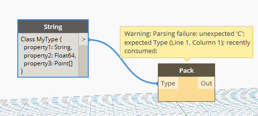
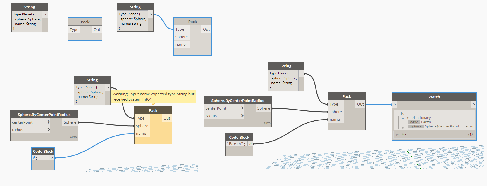
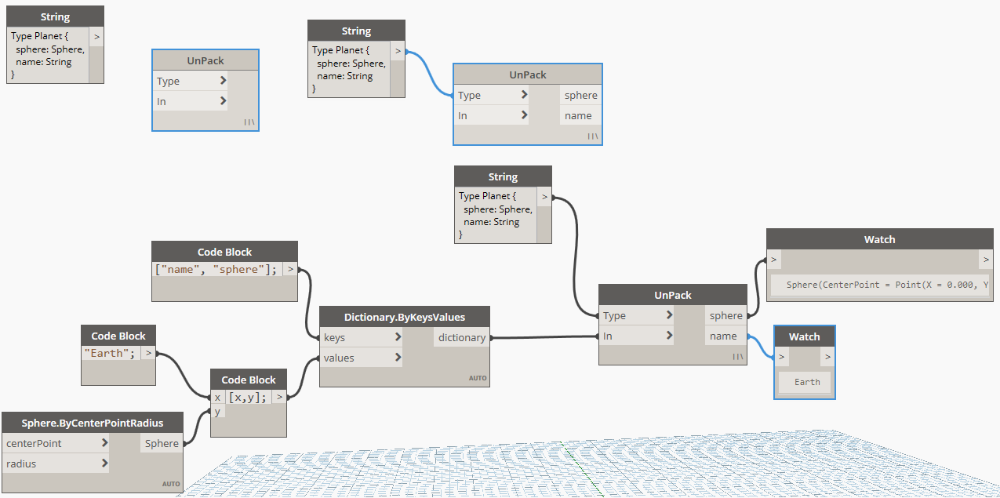
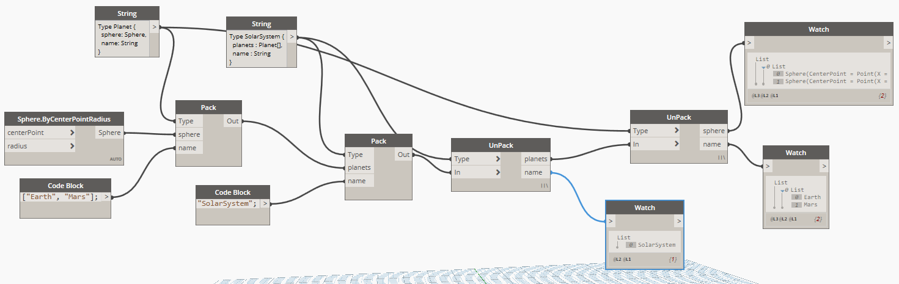

# Packing Nodes
The idea behind Packing nodes is to bring in type definitions (partially) inside Dynamo and have a way of building multi-level custom types with basic validations.

In this example, the `Data Bridge` callback is used to allow the nodes to redefine their `InPorts` and `OutPorts` after running the graph so it matches an arbitrary defined type.

Below is a bit more information on that feature and its implementation.

## TypeDefinition
In order to bring in a way to define types for the Packing Nodes, this example uses [Sprache](https://github.com/sprache/Sprache/) to create a Typescript-like syntax parser. 

### Syntax
The syntax is quite simple. The initial keyword is `Type`, which must be followed by a word representing the type name and then a pair of `{ }` containing one or more properties defined as `name`, `:`, `Type` and seperated by a `,`. Like in Typescript, `[]` can be added to a property Type to indicate a collection.

### Faulty Syntax

An error made in the syntax will be outlined by Sprache

## Pack
The purpose of the Pack node is to take in a TypeDefinition (in this case from a string) and redefine its InPorts to fit with the given type. When running, some basic validation of types occurs.
Assuming no validation errors, it then outputs a dictionary (or list of dictionaries, as it does some lacing) corresponding to the input values.

## UnPack
The purpose of the UnPack node is to complete the Pack node in a symmetric way. It takes in a TypeDefinition (currently from a string) and redefine its outports to show every property of that type definition. It then expects a dictionary (or list of dictionary) as an additional input and unpacks its content by mapping them to the different OutPorts.

## Nested Types
It's possible to define types and re-use them in other Pack/UnPack nodes.

